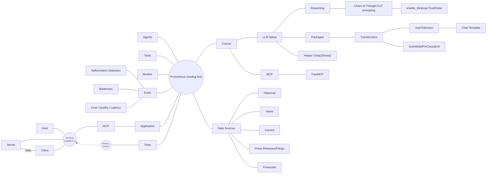

# main

```mermaid
flowchart RL
    main(("Prometheus (trading bot)")) --- Agents
    main --- Tools
    main --- Models
    main --- evals[Evals]
    evals --- hall["Hallucination Detection"]
    evals --- Brittleness
    evals --- cost["Cost / Quality / Latency"]
    main --- Application
    Application --- appMcp[MCP]
    appMcp --- server(("server.py<br/>(FastMCP 4)"))
    server --- archHost[Host]
    server --- archClient[Client]
    server --- archServer[Server]
    archClient ---|stdio| archServer
    main --- Tests
    Tests --- testMcp(("fastmcp_<br/>tools.py"))
    testMcp -.-> server
    Course --- main
    classDef tightCircle font-size:11px
    classDef tinyCircle font-size:10px
    class server tightCircle
    class testMcp tinyCircle
    llm["LLM Setup"] --- Course
    reasoning[Reasoning] --- llm
    cot["Chain-of-Thought CoT prompting"] --- reasoning
    thinking["enable_thinking=True|False"] --- cot
    packages[Packages] --- llm
    chatfn["Helper Chat()/Show()"] --- llm
    transformers[Transformers] --- packages
    tokenizer[AutoTokenizer] --- transformers
    chat["Chat Template"] --- tokenizer
    model[AutoModelForCausalLM] --- transformers
    MCP --- Course
    fast[FastMCP] --- MCP
    sources["Data Sources"] --- main
    Historical --- sources
    News --- sources
    Current --- sources
    filings["Press Releases/Filings"] --- sources
    Financials --- sources
```
